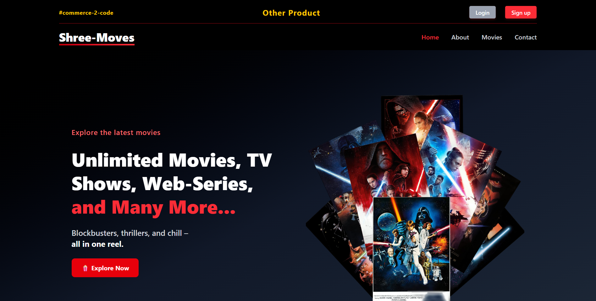
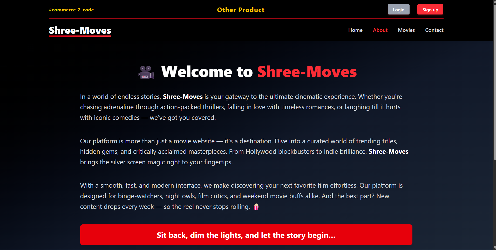

# 🎬 Shree Movies Website

Welcome to **Shree Movies**, a modern movie browsing website built using **React**. It offers users a clean and engaging interface to explore movie listings, read descriptions, and get IMDb-style details — all with responsive UI and interactive animations.

---

## 📌 Live Preview

🔗 [Live Site](https://shree-moves.netlify.app/)  

---

## 🚀 Features

- 🔍 Search for movies by title
- 🎥 Detailed movie cards with ratings and genres
- ❤️ Like / dislike system (UI mock only)
- 📱 Fully responsive (desktop & mobile)
- 🌙 Dark-themed interface
- ✨ Framer Motion for smooth animations
- 🧩 Reusable React components

---

## 🛠️ Tech Stack

- **Frontend**: React, Tailwind CSS, JSX, Framer Motion  
- **Routing**: React Router  
- **API**: OMDb API (Optional) or static data  
- **Deployment**: Netlify

---

## 📸 Screenshots

### 🏠 Homepage

### ℹ️ About Page

---

## 📂 Project Structure

shree-moves/
├── public/
│   ├── about.png
│   ├── home.png
│   ├── error.png
│   ├── favicon.png
│   ├── github.png
│   ├── instagram.png
│   ├── linkedin.png
│   ├── movies.png
│   ├── twitter.png
│   └── vite.svg
│
├── src/
│   └── ... (your React components and logic)
│
├── .env.example
├── .gitignore
├── index.html
├── package.json
├── package-lock.json
├── README.md
└── vite.config.js or eslint.config.js (if applicable)

---

## ⚙️ Getting Started

### 1. Clone the repository

  bash --
        git clone https://github.com/Dreamergopal/movies-website.git
        cd movies-website

### 2. Install dependencies

  npm install

### 3. Start the development server

  npm run dev

### 4. Open in browser

Visit: http://localhost:5173/

---

📧 Contact
Find me on 👉      

or raise an issue for suggestions/improvements.

